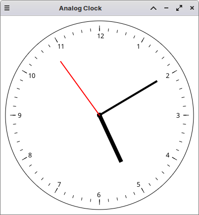

# JClockPanelFX

A JavaFX application that displays an interactive analog clock face. It provides a visually appealing representation of the current time using traditional clock hands.

## Features

- Real-time visualization of the current time on an analog clock face
- Hour, minute, and second hands that move dynamically to reflect the current time
- Clear and intuitive interface

